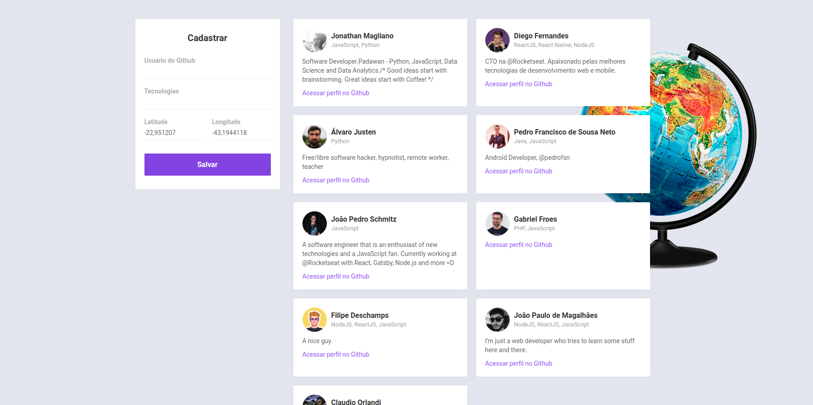
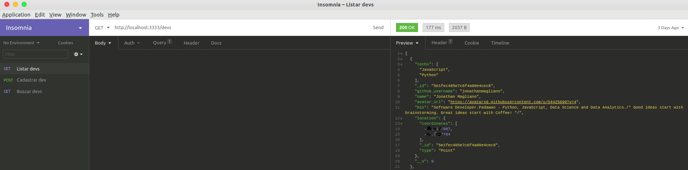

<h1 align="center">
    
</h1>

<h4 align="center">
  Semana OmniStack 10
</h4>
<p align="center">
  <a href="https://github.com/jonathanmagliano/Omnistack/stars">
    
  </a>
  
  <a href="https://github.com/jonathanmagliano/Omnistack/commits/master">
    
  </a>

  <a href="https://github.com/jonathanmagliano/Omnistack/issues">
    
  </a>

  
</p>

<p align="center">
  <a href="#projeto">Projeto</a>&nbsp;&nbsp;&nbsp;|&nbsp;&nbsp;&nbsp;	
  <a href="#tecnologias">Tecnologias</a>&nbsp;&nbsp;&nbsp;|&nbsp;&nbsp;&nbsp;
  <a href="#instalação">Instalação</a>&nbsp;&nbsp;&nbsp;|&nbsp;&nbsp;&nbsp;
  <a href="#-como-contribuir">Como contribuir</a>&nbsp;&nbsp;&nbsp;|&nbsp;&nbsp;&nbsp;
  <a href="#layout">Layout</a>&nbsp;&nbsp;&nbsp;|&nbsp;&nbsp;&nbsp;
  <a href="#memo-licença">Licença</a>
</p>

<br>

<p align="center">
  
</p>

<p align="center">
  
</p>

## 💻 Projeto 
O AlertaDev é um projeto que consiste basicamente na busca por Developers (pré-cadastrados) ao redor da sua região por geolocalização (Mobile) e por filtro de tecnologia. E a essência desse projeto pode fomentar inúmeras ramificações criativas.
O Projeto AlertaDev foi desenvolvido durante a Semana Omnistack da Rocketseat.

## Tecnologias
Esse projeto foi desenvolvido com as seguintes tecnologias:

- [Node.js](https://nodejs.org/en/)
- [React](https://reactjs.org)
- [React Native](https://facebook.github.io/react-native/)
- [Expo](https://expo.io/)

## Instalação
Configure o MongoDB e atualize a string de conexão com seu `User:Senha` no arquivo `index.js`.
Para instalar as dependências e executar o **Servidor** (modo desenvolvimento), clone o projeto em seu computador e em seguida execute:
```bash
cd backend
yarn install
yarn dev
```
Para iniciar o frontend **Web** do React utilize os comandos:
```bash
cd web
yarn install
yarn start
```
Assim que o processo terminar, automaticamente será aberta no seu navegador a página `localhost:3000` contendo o Projeto desenvolvido no frontend web.

Para testar o **Mobile** do React Native, primeiro coloque o endereço do seu servidor (ou computador) no arquivo `src/services/api.js` e depois execute os comandos:
```bash
# NÃO é preciso executar a linha de baixo caso já tenha o Expo (CLI) instalado!
yarn global add install expo-cli
cd mobile
yarn install
yarn start
```
Assim que o processo terminar, automaticamente será aberta no seu navegador a página `localhost:19002`. Conecte o seu emulador ou teste o aplicativo por `LAN`: baixe o aplicativo *Expo* da Play Store ou App Store e em seguida escaneie o código QR.

## 🤔 Como contribuir
- Faça um fork desse repositório;
- Cria uma branch com a sua feature: `git checkout -b minha-feature`;
- Faça commit das suas alterações: `git commit -m 'feat: Minha nova feature'`;
- Faça push para a sua branch: `git push origin minha-feature`.

Depois que o merge da sua pull request for feito, você pode deletar a sua branch.

## Layout
Você pode baixar o layout do projeto no formato `.sketch` através [desse link](./criptobiose/AlertaDev.sketch).

Para abrir arquivos no formato `.sketch` em qualquer sistema operacional, utilize a ferramenta [Figma](https://figma.com).

## Insomnia 
Para testar a API do AlertaDev, baixe e instale o [Insomnia](https://insomnia.rest/). Minha aplicação:

</img>

## :memo: Licença
Licença MIT. Veja o arquivo [LICENSE](LICENSE.md) para mais detalhes.

## Agradecimentos
Eu gostaria brevemente de parabenizar o enorme impacto positivo que a equipe [Rocketseat](https://rocketseat.com.br/)♥:wave: está causando na comunidade JavaScript e consequentemente na vida de milhares. Enfatizo o quanto que a equipe está gerando de oportunidades tanto para o iniciante no nicho até o mais experiente. Gratidão!
